# Overview
This project demonstrate how to manage and devlop a python project using CI/CD with Azure Devops

## Project Plan
* [Trello dashboard](https://trello.com/invite/b/LjM02f9V/ATTIc3ae49bf99e261765976ec7261453b1e9AAD8CCF/devops-cicd)

* [Spreadsheet](https://docs.google.com/spreadsheets/d/13dpzdWq9o4rJQGc9_PalnsjQQR-BhnE6FWobD3n_l38/edit?usp=sharing)

## Instructions

### The architectural Diagram:
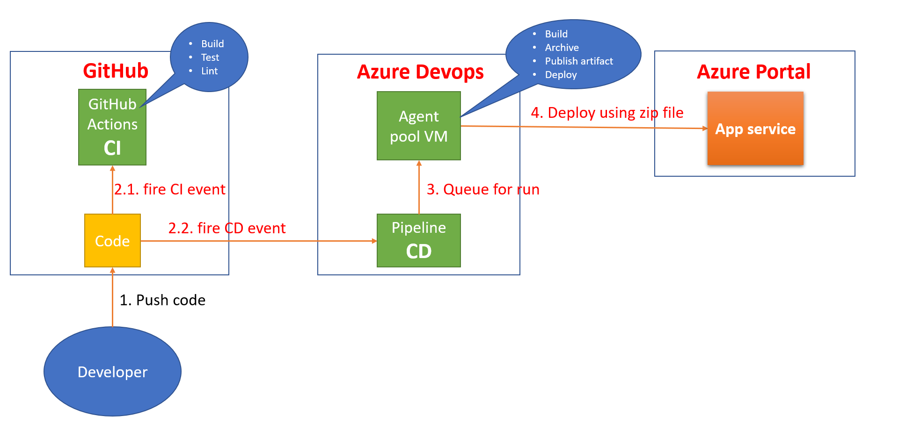

### Instructions for running the Python project
#### Project cloned into Azure Cloud Shell and test
* Open Cloud shell using bash and clone project then go to project folder:

`$ git clone https://github.com/nghianv201096/flask-sklearn.git`
`$ cd flask-sklearn`

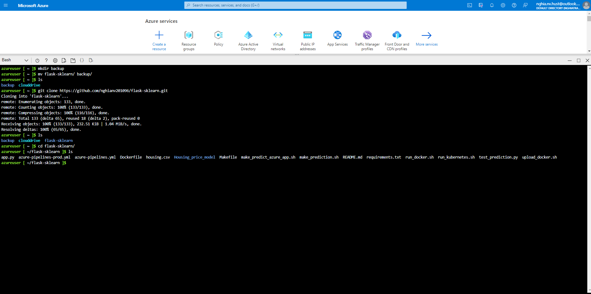

* Perfom testing 
`$ python3 -m venv ~/.myrepo`
`$ source ~/.myrepo/bin/activate`
`$  make all`

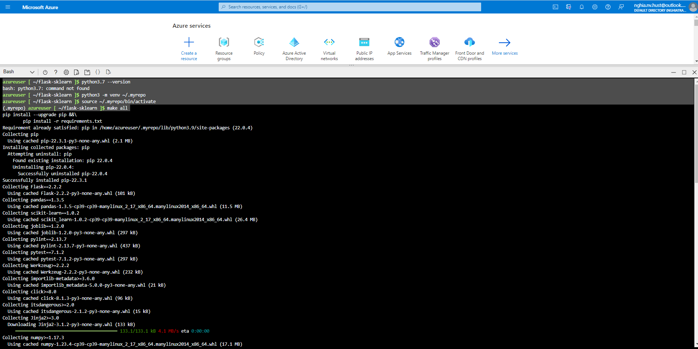

* See the testing result:
After above step you see dependencies are installed, lint rate 10/10 and tests are passed as below:
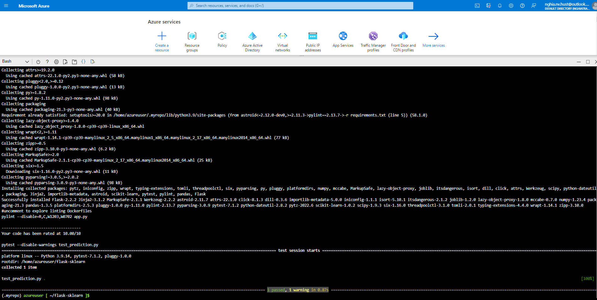
#### Project running on Azure App Service

* You can deploy this project direct to azure using command:
`$az webapp up -n "azure-cicdapp"`

And see the result deploy successfully:
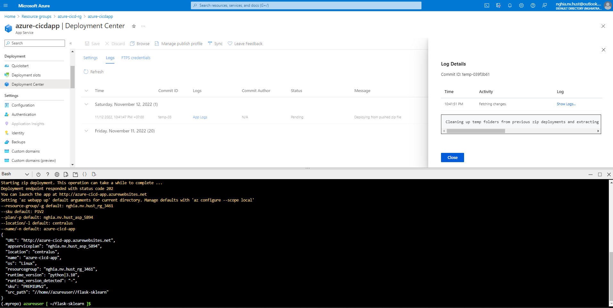

Can go to the url and check as well:
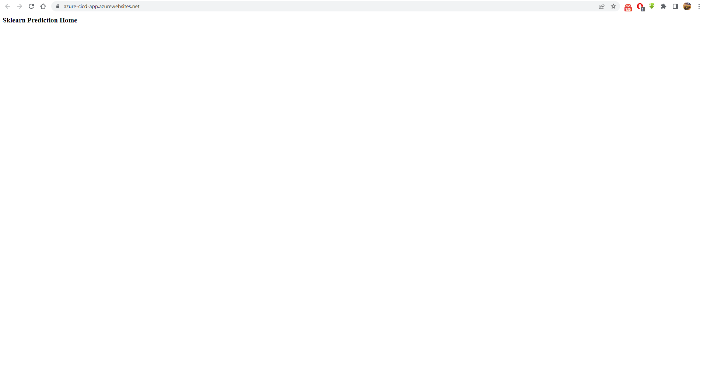

* Successful deploy of the project in Azure Pipelines.  [Note the official documentation should be referred to and double checked as you setup CI/CD](https://docs.microsoft.com/en-us/azure/devops/pipelines/ecosystems/python-webapp?view=azure-devops).
After follow the above link, each time you push code and run pipeline manually you can see the deply is successful like that:
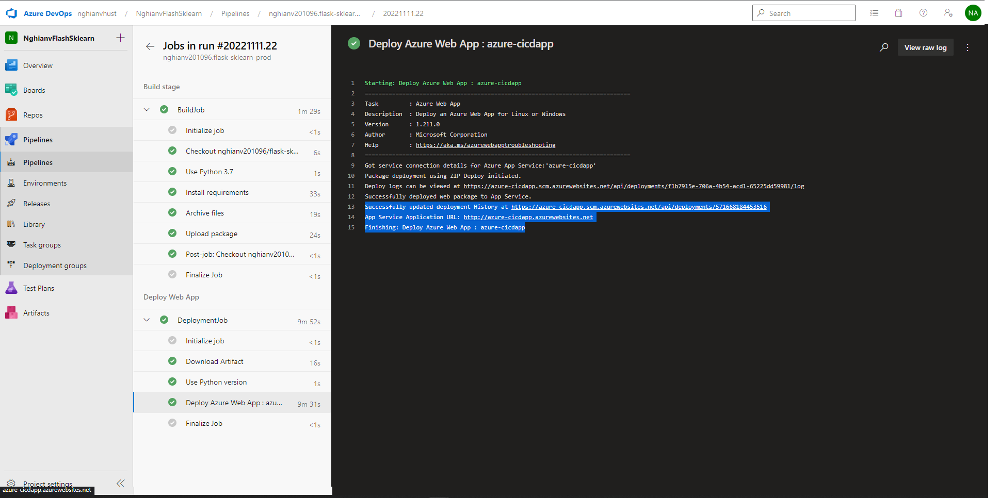

Note: the app service is created before, you can reference to **terraform** folder in project to see how to create the app service.

* Running Azure App Service from Azure Pipelines automatic deployment
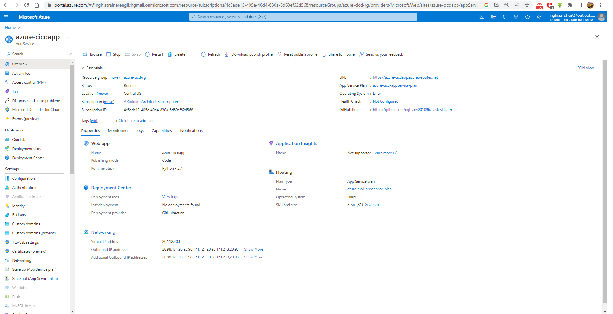

* Successful prediction from deployed flask app in Azure Cloud Shell.  [Use this file as a template for the deployed prediction](https://github.com/udacity/nd082-Azure-Cloud-DevOps-Starter-Code/blob/master/C2-AgileDevelopmentwithAzure/project/starter_files/flask-sklearn/make_predict_azure_app.sh).
The output should look similar to this:

```bash
$ ./make_predict_azure_app.sh
```
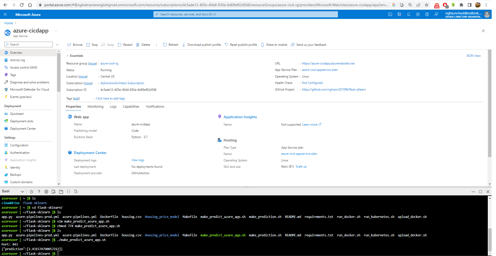

Note: I use the **LinearRegression** model, if you use other models the result can be different.

* Output of streamed log files from deployed application
`az webapp log tail -g azure-cicd-rg -n azure-cicdapp`

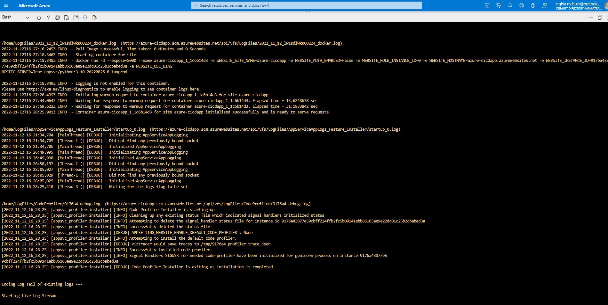

* Setup locust
    * Install locust
    ```
    # open bash terminal

    # update database
    $ sudo apt update

    # install pip3
    $ sudo apt install python3-pip

    # install locust
    $ pip3 install locust
    ```

    * run locust
    ```
    $ locust
    ```

    * Go to url: **http://0.0.0.0:8089**

    * Set the Host to your app service domain, exp: https://learn-azure.azurewebsites.com and can change the other params too

    * Click **start swarming**

    * Wait the tests done and then click **Stop** at the top right then you see the result as bellow

* Output of locust load test
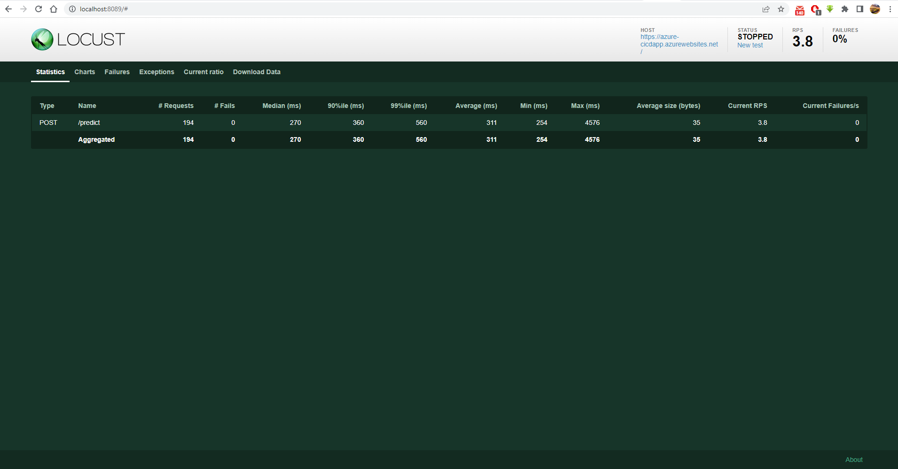

## Enhancements

In this project we only use one pipeline for one branch, in real life we need different branches for different environments so that we need:
* create terraform file to apply IaC (already done)
* create template then can create environment pipelines with ease
So that each environment we have a set of resources and its own pipeline. Developer just merge the code to target branch, don have to care about build, test, deploy,...

## Demo 
[Youtube](https://www.youtube.com/watch?v=P6WsYP61uEc&ab_channel=Ngh%C4%A9aNguy%E1%BB%85nV%C4%83n)


